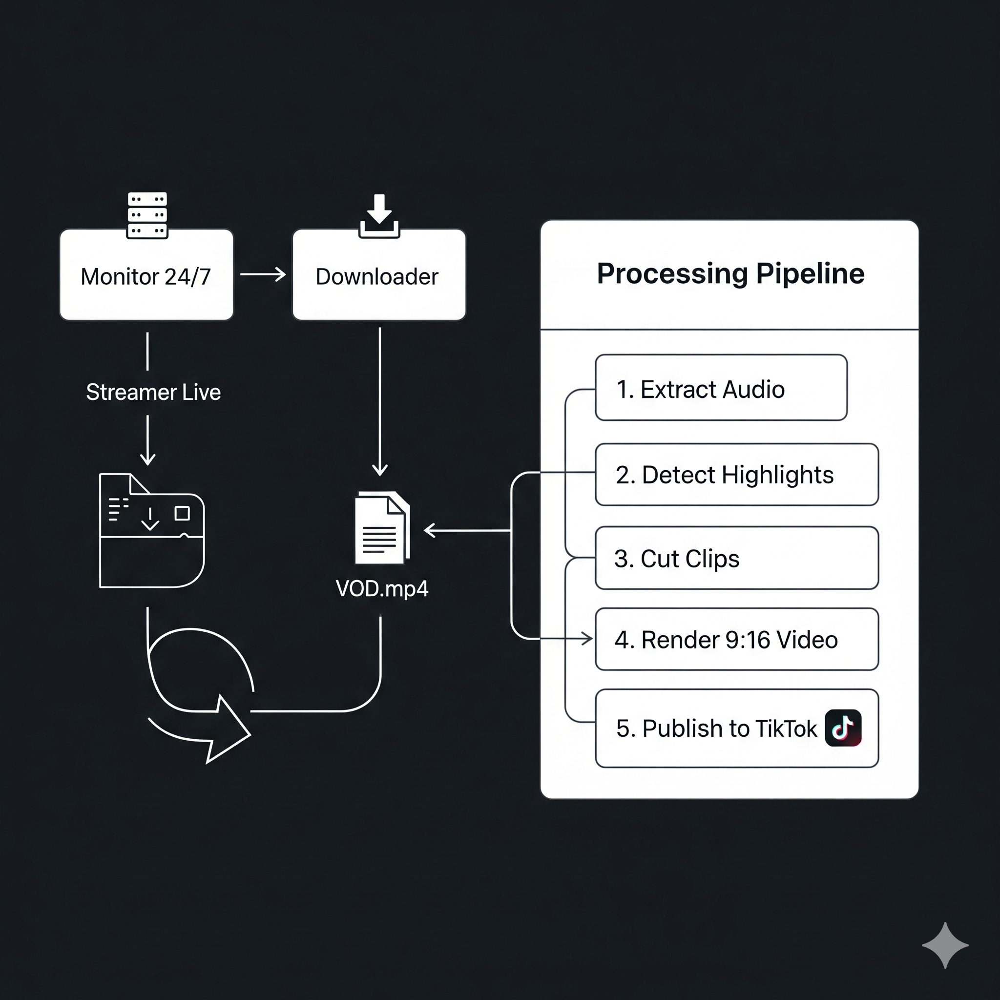

# Streamliner-AI 🤖🎬

[](https://github.com/anthonydavalos/streamliner-ai/actions/workflows/ci.yml)
[](https://www.python.org/downloads/)
[](https://opensource.org/licenses/MIT)

**Streamliner-AI** es un pipeline 100% automático y asíncrono en Python, diseñado para monitorizar streamers de Kick, detectar momentos virales, generar clips verticales optimizados para redes sociales y publicarlos en TikTok sin intervención manual.

---

## 📋 Tabla de Contenidos
1. [✨ Características Principales](#-características-principales)
2. [⚙️ Arquitectura del Sistema](#️-arquitectura-del-sistema)
3. [🚀 Guía de Inicio Rápido](#-guía-de-inicio-rápido)
4. [🔧 Instalación y Configuración Detallada](#-instalación-y-configuración-detallada)
    - [Prerrequisitos](#prerrequisitos)
    - [Pasos de Instalación](#pasos-de-instalación)
    - [Configuración de Credenciales y Parámetros](#configuración-de-credenciales-y-parámetros)
5. [💻 Uso de la Aplicación](#-uso-de-la-aplicación)
    - [Modo Monitor (Producción)](#modo-monitor-producción)
    - [Modo de Procesamiento Manual (Pruebas)](#modo-de-procesamiento-manual-pruebas)
6. [🐳 Despliegue con Docker](#-despliegue-con-docker)
7. [🛠️ Guía de Desarrollo](#️-guía-de-desarrollo)
    - [Configuración de Visual Studio Code](#configuración-de-visual-studio-code)
    - [Ejecutar Pruebas](#ejecutar-pruebas)
8. [🧠 Profundización Técnica](#-profundización-técnica)
9. [📈 Mejoras Futuras](#-mejoras-futuras)

---

## ✨ Características Principales

* **Monitorización Asíncrona:** Utiliza `asyncio` para vigilar múltiples streamers de Kick de forma concurrente y eficiente con un solo proceso.
* **Detección Inteligente y Eficiente:**
    * Analiza la energía del audio (RMS) para encontrar picos de emoción rápidamente.
    * Utiliza `faster-whisper` (una implementación optimizada de Whisper) para transcribir **únicamente** los segmentos de alta energía, ahorrando una enorme cantidad of tiempo de procesamiento.
    * Un sistema de puntuación personalizable combina la energía y palabras clave para identificar los mejores momentos.
* **Renderizado Vertical Automático:** Emplea `ffmpeg` para crear clips en formato 9:16 con un fondo desenfocado, el clip original centrado y subtítulos quemados con estilos personalizables.
* **Publicación en TikTok:** Se integra con la API de Contenido de TikTok para subir los clips generados de forma automática, incluyendo descripción y hashtags.
* **Almacenamiento Flexible:** Soporte nativo para guardar archivos en el disco local, AWS S3 o Cloudflare R2, configurable a través de una variable de entorno.
* **CLI Robusta:** Interfaz de Línea de Comandos basada en `click` para una gestión sencilla y clara de la aplicación.
* **Listo para Producción:** Incluye configuración para `Docker`, pruebas unitarias y un pipeline de Integración Continua (CI) con GitHub Actions.

## ⚙️ Arquitectura del Sistema

El sistema opera como un pipeline secuencial de eventos, orquestado por `asyncio`.



## 🚀 Guía de Inicio Rápido

```bash
# 1. Clonar el repositorio
git clone https://github.com/tu-usuario/streamliner-ai.git
cd streamliner-ai

# 2. Crear entorno virtual con Python 3.10
python -m venv venv
source venv/bin/activate  # En Windows/PowerShell: .\venv\Scripts\Activate

# 3. Instalar dependencias
pip install -r requirements.txt

# 4. Configurar
cp config.yaml.example config.yaml
cp .env.template .env
# (Edita config.yaml y .env con tus datos)

# 5. Ejecutar una prueba con un video local
python -m src.streamliner.cli process --file "ruta/a/tu/video.mp4" --streamer "test" --dry-run

# 6. Iniciar el modo de monitorización
python -m src.streamliner.cli monitor
```

## 🔧 Instalación y Configuración Detallada

### Prerrequisitos

  * **Git:** Para clonar el repositorio.
  * **Python 3.10:** Aunque es posible usar versiones más nuevas de Python, la **versión 3.10** ofrece la máxima compatibilidad con todas las librerías de procesamiento de video y audio utilizadas en este proyecto. **Se recomienda encarecidamente usar Python 3.10 para evitar errores de instalación.**
  * **FFmpeg:** Una dependencia de sistema crucial. `pydub`, `scenedetect` y nuestro código lo usan para cualquier operación de video/audio. Debe estar instalado y accesible en el PATH de tu sistema.
  * **(Opcional) Docker & Docker Compose:** Para un despliegue más sencillo y aislado.

### Pasos de Instalación

1. **Clona el repositorio:**

    ```bash
    git clone https://github.com/tu-usuario/streamliner-ai.git
    cd streamliner-ai
    ```

2. **Crea el entorno virtual:** Es fundamental usar la versión de Python recomendada para asegurar la compatibilidad.

    ```bash
    python -m venv venv
    ```

3. **Activa el entorno virtual:**

      * En Linux o macOS:
        ```bash
        source venv/bin/activate
        ```
      * En Windows (PowerShell):
        ```bash
        .\venv\Scripts\Activate
        ```

    Verás un `(venv)` al principio de la línea de tu terminal.

4. **Instala las dependencias de Python:**

    ```bash
    pip install -r requirements.txt
    ```

### Configuración de Credenciales y Parámetros

Necesitas crear dos archivos de configuración a partir de las plantillas proporcionadas.

1. **Variables de Entorno (`.env`):**
    Copia la plantilla y edita el archivo resultante. Este archivo contiene los secretos y credenciales. **Nunca debe subirse a Git.**

    ```bash
    cp .env.template .env
    nano .env  # O usa tu editor de texto preferido
    ```

    Rellena los campos `TIKTOK_*`, y si vas a usar S3/R2, las credenciales de `AWS_*`.

2. **Configuración de la Aplicación (`config.yaml`):**
    Copia la plantilla y edita el archivo. Este archivo controla el comportamiento de la aplicación.

    ```bash
    cp config.yaml.example config.yaml
    nano config.yaml
    ```

    Añade los nombres de los canales de Kick que quieres monitorizar en la sección `streamers:`.

## 💻 Uso de la Aplicación

Asegúrate de tener siempre el entorno virtual activado (`source venv/bin/activate`).

### Modo Monitor (Producción)

Este es el modo principal, diseñado para correr 24/7. Vigilará a los streamers de tu configuración y procesará sus VODs automáticamente.

```bash
python -m src.streamliner.cli monitor
```

Para detenerlo, presiona `Ctrl + C` en la terminal.

### Modo de Procesamiento Manual (Pruebas)

Este modo es perfecto para depurar y para procesar un video que ya tienes descargado.

```bash
python -m src.streamliner.cli process --file "ruta/del/video.mp4" --streamer "nombre_streamer" --dry-run
```

  * `--file`: La ruta al archivo de video que quieres procesar.
  * `--streamer`: El nombre del streamer para usar en las plantillas de descripción.
  * `--dry-run`: (Opcional) Ejecuta todo el pipeline pero **no** sube el clip final a TikTok. Ideal para pruebas.

## 🐳 Despliegue con Docker

Docker simplifica el despliegue al empaquetar la aplicación con todas sus dependencias (incluyendo `ffmpeg`) en un contenedor aislado.

1. **Construye la imagen de Docker:**
    Desde la raíz del proyecto, ejecuta:

    ```bash
    docker-compose build
    ```

2. **Inicia el servicio en segundo plano:**

    ```bash
    docker-compose up -d
    ```

3. **Para ver los logs del contenedor:**

    ```bash
    docker-compose logs -f
    ```

4. **Para detener el servicio:**

    ```bash
    docker-compose down
    ```

## 🛠️ Guía de Desarrollo

### Configuración de Visual Studio Code

Crea una carpeta `.vscode` en la raíz del proyecto con los siguientes archivos para una experiencia de desarrollo óptima.

**`.vscode/settings.json`** (habilita el formateo automático con `ruff`)

```json
{
    "python.defaultInterpreterPath": "${workspaceFolder}/venv/bin/python",
    "[python]": {
        "editor.defaultFormatter": "charliermarsh.ruff",
        "editor.formatOnSave": true,
        "editor.codeActionsOnSave": {
            "source.fixAll": true
        }
    }
}
```

**`.vscode/launch.json`** (permite depurar con F5)

```json
{
    "version": "0.2.0",
    "configurations": [
        {
            "name": "Monitor Mode",
            "type": "python",
            "request": "launch",
            "module": "src.streamliner.cli",
            "args": ["monitor"],
            "console": "integratedTerminal"
        },
        {
            "name": "Process Local File (Dry Run)",
            "type": "python",
            "request": "launch",
            "module": "src.streamliner.cli",
            "args": [
                "process",
                "--file", "data/test_video.mp4", // Cambia esto a un video de prueba
                "--streamer", "teststreamer",
                "--dry-run"
            ],
            "console": "integratedTerminal"
        }
    ]
}
```

### Ejecutar Pruebas

Para asegurarte de que todo funciona correctamente, puedes ejecutar las pruebas unitarias:

```bash
pytest
```

## 🧠 Profundización Técnica

  * **Async-first:** La elección de `asyncio` permite manejar múltiples operaciones de I/O (esperas de red para la API de Kick, descargas de video, subidas) de forma concurrente en un solo hilo, lo que es mucho más eficiente en recursos que un enfoque basado en hilos tradicional.
  * **Subprocesos No Bloqueantes:** Usamos `asyncio.create_subprocess_exec` para llamar a `ffmpeg` y `streamlink`. Esto permite que nuestro programa principal continúe funcionando y manejando otras tareas mientras estos programas externos, que pueden tardar mucho, hacen su trabajo en segundo plano.
  * **Detector Optimizado:** La decisión de no transcribir el VOD completo es la optimización más importante del sistema. El análisis de energía RMS es computacionalmente muy barato y actúa como un filtro de alta velocidad para reducir un VOD de horas a solo unos minutos de audio "interesante", que son los únicos que se procesan con el costoso modelo de IA.

## 📈 Mejoras Futuras

  * **Procesamiento en Tiempo Real:** Rediseñar el `downloader` para que trabaje con "chunks" (trozos) de video en lugar de un VOD completo, permitiendo la creación de clips a los pocos minutos de que ocurra la acción en vivo.
  * **Dashboard de Métricas:** Integrar Prometheus y Grafana para visualizar el estado de los monitores, clips generados, errores, etc.
  * **Scoring con Machine Learning:** Entrenar un modelo más avanzado que pueda analizar no solo el audio, sino también la velocidad del chat o eventos del juego para una detección de highlights más precisa.
  * **Soporte Multiplataforma:** Abstraer los módulos de descarga y publicación para añadir soporte para Twitch, YouTube, y para publicar en Instagram Reels o YouTube Shorts.
  * **Interfaz de Usuario Web:** Crear una pequeña UI con FastAPI y React/Vue para gestionar la lista de streamers y ver los clips generados sin tener que editar archivos de configuración.

-----

*Este proyecto fue generado y depurado con la asistencia de un modelo de IA avanzado.*
