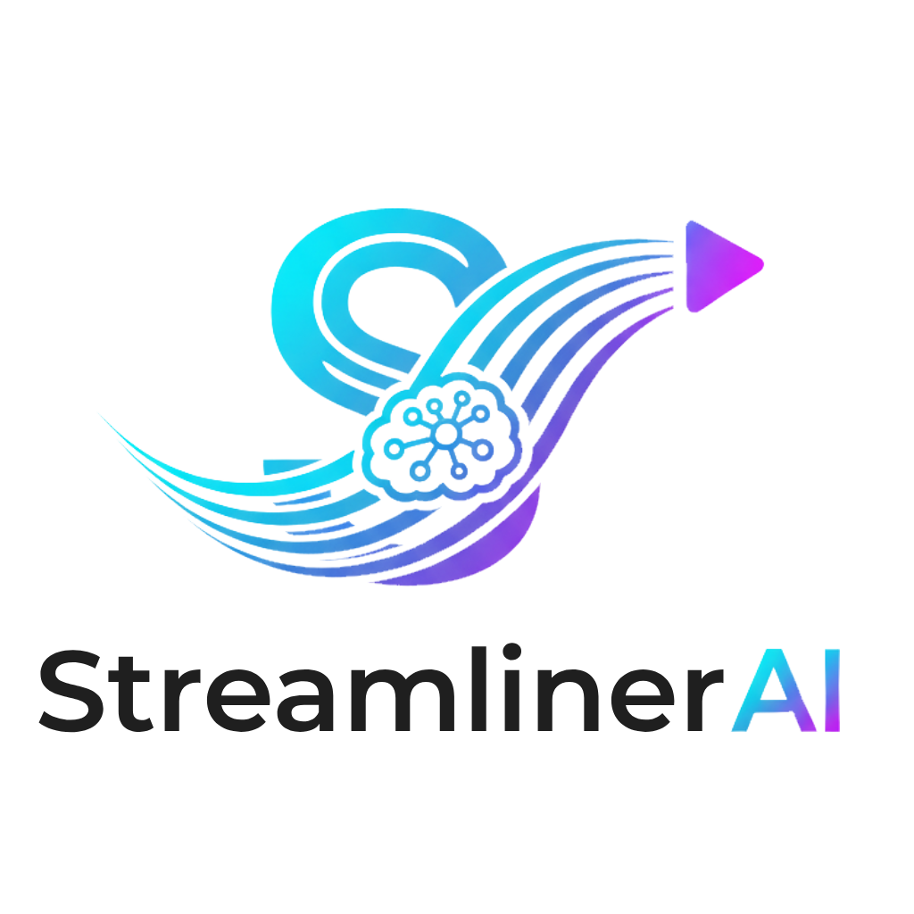

# Streamliner-AI 🤖🎬

[](https://github.com/anthonydavalos/streamliner-ai/actions/workflows/ci.yml)
[](https://www.python.org/downloads/)
[](https://opensource.org/licenses/MIT)



**Streamliner-AI** es un pipeline 100% automático y asíncrono en Python, diseñado para monitorizar streamers de Kick, detectar momentos virales de alta emoción, generar clips verticales optimizados para redes sociales y publicarlos en TikTok sin intervención manual.

Este proyecto utiliza la **API oficial de Kick**, autenticándose vía **OAuth2 (Client Credentials)** para una monitorización estable, eficiente y robusta.

-----

## 📋 Tabla de Contenidos

1.  [✨ Características Principales](#-características-principales)
2.  [⚙️ Arquitectura del Sistema](#️-arquitectura-del-sistema)
3.  [🚀 Guía de Inicio Rápido](uía-de-inicio-rápido)
4.  [🔧 Instalación y Configuración Detallada](#-instalación-y-configuración-detallada)
      - [Prerrequisitos](#prerrequisitos)
      - [Pasos de Instalación](#pasos-de-instalación)
      - [Configuración de la API de Kick](#configuración-de-la-api-de-kick)
      - [Configuración de la API de TikTok](#configuración-de-la-api-de-tiktok)
      - [Configuración del Proyecto](#configuración-del-proyecto)
5.  [💻 Uso de la Aplicación](#-uso-de-la-aplicaci%C3%B3n)
6.  [🐳 Despliegue con Docker](#-despliegue-con-docker)
7.  [🛠️ Guía de Desarrollo](#️-guía-de-desarrollo)
8.  [🧠 Profundización Técnica: El Camino a la API Oficial](#-profundización-técnica-el-camino-a-la-api-oficial)
9.  [📈 Mejoras Futuras](#configuración-de-la-api-de-kick-mejoras-futuras)

-----

## ✨ Características Principales

  * **Autenticación Oficial:** Se conecta a la API de Kick usando el flujo **OAuth2 Client Credentials**, garantizando un acceso estable y autorizado.
  * **Monitorización Asíncrona:** Utiliza `asyncio` y `httpx` para vigilar múltiples streamers de forma concurrente y eficiente con un solo proceso.
  * **Detección Inteligente y Eficiente:**
      * Analiza la energía del audio (RMS) para encontrar picos de emoción rápidamente.
      * Utiliza `faster-whisper` para transcribir **únicamente** los segmentos de alta energía, ahorrando tiempo de procesamiento.
      * Un sistema de puntuación personalizable combina la energía del audio y **más de 200 palabras clave y jergas peruanas** para identificar los mejores momentos.
  * **Renderizado Vertical Automático:** Emplea `ffmpeg` para crear clips en formato 9:16 con fondo desenfocado, el clip original centrado y subtítulos quemados con estilos personalizables.
  * **Publicación en TikTok:** Se integra con la API de Contenido de TikTok para subir los clips generados de forma automática.
  * **CLI Robusta:** Interfaz de Línea de Comandos basada en `click` para una gestión sencilla.
  * **Listo para Producción:** Incluye configuración para `Docker`, pruebas unitarias y un pipeline de Integración Continua (CI) con GitHub Actions.

## ⚙️ Arquitectura del Sistema

El sistema opera como un pipeline estable que utiliza la autenticación oficial de Kick para asegurar el acceso a los datos.


## 🚀 Guía de Inicio Rápido

```bash
# 1. Clonar el repositorio
git clone https://github.com/tu-usuario/streamliner-ai.git
cd streamliner-ai

# 2. Crear entorno virtual (ej. con Python 3.13.3)
python -m venv venv

# Activar el entorno
# En Windows/PowerShell:
.\venv\Scripts\Activate
# En Linux/macOS:
source venv/bin/activate

# 3. Instalar dependencias
pip install -r requirements.txt

# 4. Configurar
# (Obtén CLIENT_ID y CLIENT_SECRET del portal de desarrolladores de Kick)
cp .env.template .env
cp config.yaml.example config.yaml
# (Edita .env y config.yaml con tus datos)

# 5. Ejecutar una prueba con un video local
python -m src.streamliner.cli process --file "ruta/a/tu/video.mp4" --streamer "test" --dry-run

# 6. Iniciar el modo de monitorización
python -m src.streamliner.cli monitor
```

## 🔧 Instalación y Configuración Detallada

### Prerrequisitos

  * **Git:** Para clonar el repositorio.
  * **Python (3.10 - 3.13):** Este proyecto fue desarrollado y probado exitosamente con Python 3.13.3. Se recomienda usar una versión igual o superior a la 3.10 para asegurar la compatibilidad de las librerías.
  * **FFmpeg:** Dependencia de sistema crucial para cualquier operación de video/audio. Debe estar instalado y accesible en el PATH de tu sistema.
  * **Cuenta de Desarrollador de Kick:** Necesaria para obtener las credenciales de la API.

### Pasos de Instalación

Sigue los pasos de la [🚀 Guía de Inicio Rápido](#guía-de-inicio-rápido). El comando `python -m venv venv` usará la versión de Python que tengas por defecto en tu sistema.

### Configuración de la API de Kick

1.  **Crea una Aplicación:** Ve al [Portal de Desarrolladores de Kick](https://dev.kick.com) y crea una nueva aplicación.
2.  **Redirect URL:** Durante la creación, te pedirá una "Redirect URL". Ingresa `http://localhost` o `http://localhost:8080`. Este campo es obligatorio pero no se usa en nuestro flujo de autenticación.
3.  **Scopes:** Selecciona los permisos (`scopes`) que necesitará tu aplicación. Para este proyecto, se recomiendan:
      * `channel:read` (Leer información del canal) - **Esencial**.
      * `user:read` (Leer información de usuario).
4.  **Obtén tus Credenciales:** Una vez creada la aplicación, Kick te proporcionará un **`Client ID`** y un **`Client Secret`**.

### Configuración de la API de TikTok

Para que Streamliner AI pueda publicar clips en tu cuenta de TikTok, necesitas obtener y configurar los tokens de autenticación iniciales.

1.  **Configura tu Aplicación en TikTok Developer Center:**
    Asegúrate de haber registrado tu aplicación en el [TikTok Developer Center](https://developers.tiktok.com/) y haber obtenido tu `Client Key` y `Client Secret`. Es crucial también configurar un "Redirect URI" válido (por ejemplo, `https://www.example.com/oauth`) en la configuración de tu aplicación de TikTok.

2.  **Añade tus Credenciales Básicas al `.env`:**
    Abre tu archivo `.env` en la raíz del proyecto y añade las siguientes líneas con tus claves obtenidas del Developer Center:
    ```
    TIKTOK_CLIENT_KEY=tu_client_key_aqui
    TIKTOK_CLIENT_SECRET=tu_client_secret_aqui
    ```

3.  **Ejecuta el Generador de Tokens:**
    Abre tu terminal en la raíz del proyecto y ejecuta el script de utilidad diseñado para esto:
    ```bash
    python scripts/generate_tiktok_tokens.py
    ```
    El script te proporcionará una URL de autorización.

4.  **Autoriza la Aplicación en tu Navegador:**
    * Copia la URL proporcionada por el script y pégala en tu navegador web.
    * Inicia sesión en TikTok con la cuenta en la que deseas que el bot publique los clips.
    * Revisa y autoriza la aplicación para acceder a los scopes solicitados (`user.info.basic`, `video.upload`, `video.list`, etc.).
    * Después de la autorización, serás redirigido a tu `Redirect URI`. La URL en tu navegador contendrá el `code` y el `open_id` en los parámetros de la URL (por ejemplo: `https://www.example.com/oauth?code=ABC...XYZ&open_id=123...456`).

5.  **Introduce los Datos en la Terminal:**
    Copia el valor del `code` y el `open_id` de la URL de redirección y pégalos en la terminal cuando el script `generate_tiktok_tokens.py` te lo pida.

6.  **Tokens Guardados Automáticamente:**
    El script procesará estos datos y guardará automáticamente el `TIKTOK_ACCESS_TOKEN`, `TIKTOK_REFRESH_TOKEN` y `TIKTOK_OPEN_ID` en tu archivo `.env`. ¡Tu bot ya estará configurado para interactuar con la API de TikTok\!

**Nota:** El `TIKTOK_ACCESS_TOKEN` se refrescará automáticamente según sea necesario, por lo que no tendrás que ejecutar este script con frecuencia una vez que hayas obtenido los tokens iniciales. Para pruebas en desarrollo, asegúrate de que `TIKTOK_ENVIRONMENT=sandbox` esté configurado en tu `.env`; para producción, cámbialo a `TIKTOK_ENVIRONMENT=production` (una vez que tu aplicación haya sido aprobada por TikTok).

### Configuración del Proyecto

1.  **Variables de Entorno (`.env`):**
    Copia la plantilla `cp .env.template .env` y rellena los siguientes campos con tus credenciales:

    ```dotenv
    KICK_CLIENT_ID="el_id_que_te_dio_kick"
    KICK_CLIENT_SECRET="el_secreto_que_te_dio_kick"

    # Rellena también las credenciales para TikTok y S3/R2 si los usarás.
    ```

2.  **Configuración de la Aplicación (`config.yaml`):**
    Copia la plantilla `cp config.yaml.example config.yaml` y edita la lista de `streamers:` con los nombres de los canales de Kick que quieres monitorizar.

## 💻 Uso de la Aplicación

Asegúrate de tener siempre el entorno virtual activado (`source venv/bin/activate`).

  * **Modo Monitor (Producción):** Es el modo principal, diseñado para correr 24/7. Vigilará a los streamers de tu configuración y procesará sus VODs automáticamente.

    ```bash
    python -m src.streamliner.cli monitor
    ```

    Para detenerlo, presiona `Ctrl + C` en la terminal.

  * **Modo de Procesamiento Manual (Pruebas):** Procesa un video que ya tengas descargado.

    ```bash
    python -m src.streamliner.cli process --file "ruta/del/video.mp4" --streamer "nombre_streamer" --dry-run
    ```

## 🐳 Despliegue con Docker

Docker simplifica el despliegue al empaquetar la aplicación con todas sus dependencias (incluyendo `ffmpeg`).

1.  **Construye la imagen:** `docker-compose build`
2.  **Inicia el servicio:** `docker-compose up -d`
3.  **Ver los logs:** `docker-compose logs -f`
4.  **Detener el servicio:** `docker-compose down`

## 🛠️ Guía de Desarrollo

### Configuración de Visual Studio Code

Crea una carpeta `.vscode` en la raíz del proyecto con los siguientes archivos para una experiencia de desarrollo óptima.

**`.vscode/settings.json`** (habilita el formateo automático con `ruff`)

```json
{
    "python.defaultInterpreterPath": "${workspaceFolder}/venv/bin/python",
    "[python]": {
        "editor.defaultFormatter": "charliermarsh.ruff",
        "editor.formatOnSave": true,
        "editor.codeActionsOnSave": {
            "source.fixAll": true
        }
    }
}
```

**`.vscode/launch.json`** (permite depurar con F5)

```json
{
    "version": "0.2.0",
    "configurations": [
        {
            "name": "Monitor Mode",
            "type": "python",
            "request": "launch",
            "module": "src.streamliner.cli",
            "args": ["monitor"],
            "console": "integratedTerminal"
        },
        {
            "name": "Process Local File (Dry Run)",
            "type": "python",
            "request": "launch",
            "module": "src.streamliner.cli",
            "args": [
                "process",
                "--file", "data/test_video.mp4", // Cambia esto a un video de prueba
                "--streamer", "teststreamer",
                "--dry-run"
            ],
            "console": "integratedTerminal"
        }
    ]
}
```

El repositorio está configurado para una experiencia de desarrollo fluida con VS Code y pruebas automatizadas. Consulta los archivos `.vscode/settings.json`, `.vscode/launch.json` y `.github/workflows/ci.yml` para más detalles.

  * **Ejecutar chequeos de calidad localmente:**
    ```bash
    # Revisa errores lógicos
    ruff check .
    # Revisa y arregla el formato del código
    ruff format .
    ```
  * **Ejecutar pruebas unitarias:**
    ```bash
    pytest
    ```

## 🧠 Profundización Técnica:

* **Async-first:** La elección de `asyncio` permite manejar múltiples operaciones de I/O (esperas de red para la API de Kick, descargas de video, subidas) de forma concurrente en un solo hilo, lo que es mucho más eficiente en recursos que un enfoque basado en hilos tradicional.
  * **Subprocesos No Bloqueantes:** Usamos `asyncio.create_subprocess_exec` para llamar a `ffmpeg` y `streamlink`. Esto permite que nuestro programa principal continúe funcionando y manejando otras tareas mientras estos programas externos, que pueden tardar mucho, hacen su trabajo en segundo plano.
  * **Detector Optimizado:** La decisión de no transcribir el VOD completo es la optimización más importante del sistema. El análisis de energía RMS es computacionalmente muy barato y actúa como un filtro de alta velocidad para reducir un VOD de horas a solo unos minutos de audio "interesante", que son los únicos que se procesan con el costoso modelo de IA.
### El Camino a la API Oficial

El desarrollo de este monitor fue un caso de estudio en perseverancia y depuración de sistemas anti-bots. Los intentos iniciales de acceder a los endpoints de Kick mediante `httpx` y `Playwright` (simulando ser un navegador) fueron consistentemente bloqueados con errores `403 Forbidden` por una robusta política de seguridad de Cloudflare (probablemente basada en TLS/JA3 Fingerprinting).

La **solución definitiva**, descubierta a través de investigación y pruebas con Google Apps Script, fue abandonar los endpoints no oficiales y utilizar el **flujo de autenticación `client_credentials` de OAuth2**, que es el método oficial que Kick proporciona a los desarrolladores.

El monitor actual implementa esta estrategia:

1.  Solicita un `App Access Token` al endpoint `https://id.kick.com/oauth/token` usando las credenciales de desarrollador.
2.  Almacena este token en memoria y lo refresca automáticamente antes de que expire.
3.  Utiliza el token para hacer llamadas autenticadas al endpoint público `/public/v1/channels`, que permite consultar el estado de múltiples streamers de forma eficiente.

Este enfoque es más estable, ligero (no requiere un navegador completo) y respetuoso con la plataforma.

## 📈 Mejoras Futuras

  * **Gestión Avanzada de Tokens:** Guardar el `access_token` y su tiempo de expiración en un archivo o una base de datos (como Redis) para que el estado persista si se reinicia el bot.
  * **Procesamiento en Tiempo Real:** Rediseñar el `downloader` para que trabaje con "chunks" de video, permitiendo la creación de clips a los pocos minutos de que ocurra la acción en vivo.
  * **Dashboard de Métricas:** Integrar Prometheus y Grafana para visualizar el estado de los monitores, clips generados, etc.

  * **Scoring con Machine Learning:** Entrenar un modelo más avanzado que pueda analizar no solo el audio, sino también la velocidad del chat o eventos del juego para una detección de highlights más precisa.
  * **Soporte Multiplataforma:** Abstraer los módulos para añadir soporte para Twitch, YouTube y otras plataformas de destino.

-----

*Este proyecto representa un intenso viaje de desarrollo, desde la idea inicial hasta una solución robusta y funcional. Para su construcción y depuración, conté con la asistencia de un modelo de IA avanzado, lo que me permitió explorar diferentes arquitecturas y resolver complejos desafíos técnicos, como eludir protecciones anti-bot y, finalmente, implementar la API oficial de Kick.*